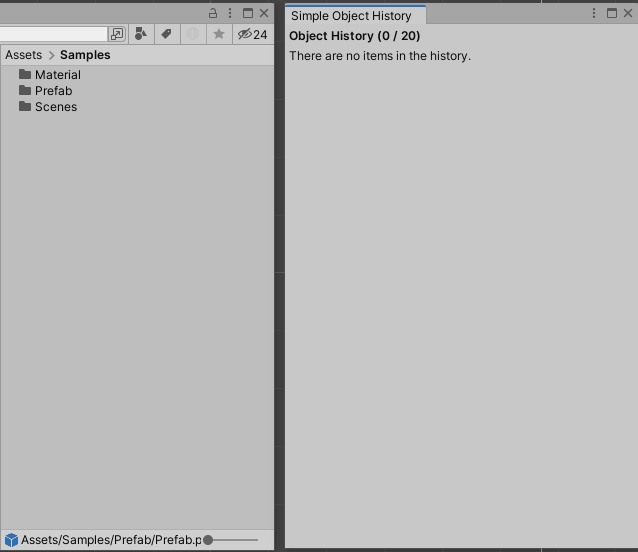

# Simple Unity Object History

This is a simple and lightweight Object History Window for Unity. The window records previously selected objects, which can be used for quick access.

## Features

- Very lightweight (one file!)
- Records selection history and allows for navigation to previously selected objects
- Additional buttons to Select or Open the Inspector for these objects

## Installation

### Option A: Install as Unity Package (Git URL)
1. Install the package with the [git URL][unity-git]: `https://github.com/chinjieh/simple-unity-object-history.git?path=/simple-unity-object-history`

### Option B: Install as Unity Package (Local Package)
1. Download or clone the repository.
2. Install the `simple-unity-object-history` folder as a [Unity Local Package][unity-local-package].

### Option C: Copy and Paste
1. Download or clone the repository.
2. Grab the script in the `simple-unity-object-history/Editor` folder, and place it in any folder in the Editor assembly in Unity (e.g. a folder named `Editor`).

## Usage

In Unity, open the window at: **Window > General > Simple Object History**. This will begin recording of the object history.

- While opened, any selection of a Unity Object (Folders, ScriptableObject, GameObject etc) will record it into the window.
- Click on an entry in the window to highlight the Object, 
- Double Click on an entry to open it as if you double-clicked on it.
- The "Select Object" button mimics a Selection on the object
- The "Open Inspector" button opens an inspector window for the object.

## Known Issues / Future Work:

1. Scene objects and objects in Prefabs are currently recorded, but will be removed from the History once the Scene or Prefab has been closed.
2. Currently, the maximum size of the History is 20, which is adjustable in the code. Future work will be to move this into a configurable plugin preference.

[unity-git]: https://docs.unity3d.com/Manual/upm-ui-giturl.html
[unity-local-package]: https://docs.unity3d.com/Manual/upm-ui-local.html